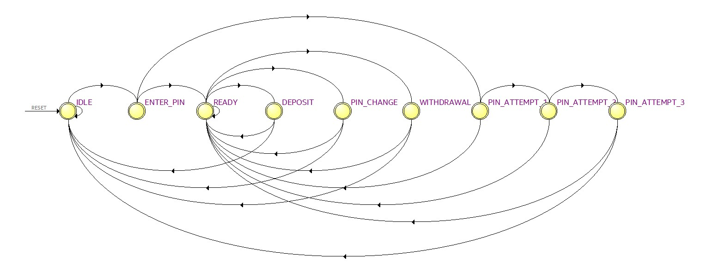

<p align="center">
  Automated Teller Machine dengan VHDL
</p>

## Tentang Proyek Ini
Membuat ATM untuk diimplementasikan pada FPGA menggunakan VHDL. 
<br> Dirancang oleh Kelompok A5 untuk Final Project Praktikum Perancangan Sistem Digital.

## Anggota Kelompok
 1. Satya Ananda Sulistio - `2106705524`
 2. Leonardo Jeremy Pongpare Munda - `2106707914`
 3. Rafi' Noval Hady - `2106703153`
 4. Ivan Indrastata Ramadhan - `2106706981`
 
## Deskripsi Proyek
Di proyek ini kami menciptakan ATM yang dapat melakukan penyetoran dan penarikan uang. Mesin ini menyediakan 7 pecahan uang rupiah `100k`, `50k`, `20k`, `10k`, `5k`, `2k`, dan `1k`. Mesin ini sudah dilengkapi pin yang terenkripsi demi keamanaan. Pengguna menyetorkan uang sesuai dengan kelipatan pecahan uang yang tersedia dan mengambil uang dengan pecahan uang yang diinginkan. Setelah transaksi selesai, pengguna dapat memilih apakah ingin melakukan transaksi lainnya.

## Tujuan
```
1. Menciptakan mesin ATM yang menyediakan pecahan uang kecil dengan memanfaatkan FSM.
2. Menerapkan testbench pada mesin untuk dilakukannya pengecekan.
3. Memberikan fleksibilitas bagi masyarakat dalam melakukan penarikan uang.
```

## State Diagram


## Link Video Penjelasan
https://youtu.be/82NdxXIPKdA